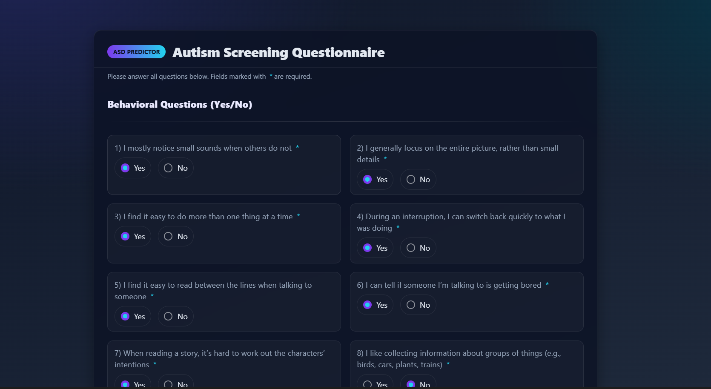
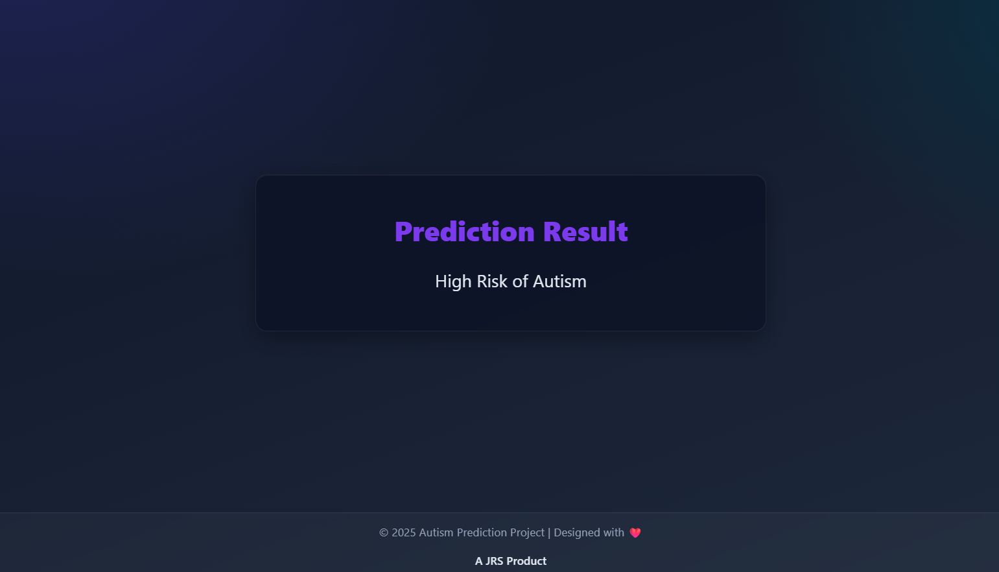

# 🧠 Autism Detection Web App  

A lightweight **Flask-based web application** that predicts the likelihood of autism spectrum disorder (ASD) using machine learning.  
The app takes responses to **behavioral and demographic questions** and provides a prediction instantly.  

### 📝 Form Page  
  

### 📊 Prediction Result  
  

## 📂 Project Structure
```
Autism_Detection/
│── requirements.txt           # Dependencies
│── README.md
│── autism-detection.ipynb     # Jupyter File
│── web-app/
│   ├── app.py                 # Flask app
│   ├── Random_Forest_best_model.pkl
│   ├── encoders.pkl
│   └── templates/
│       └── index.html
│       └── result.html
│── images/                     # App screenshots
    ├── form.png
    └── result.png
```


## 📘 About the Project 

Early detection of Autism Spectrum Disorder (ASD) is crucial for timely intervention and better outcomes.  
This project implements a **machine learning classifier** wrapped in a **Flask web app** that allows users to input questionnaire responses and get a quick prediction.  

🔹 **Tech Stack**  
- Flask (Web framework)  
- Scikit-learn (ML model: Random Forest, XGBoost, Logistic Regression, SVM)  
- Pandas & NumPy (Data handling)  
- Imbalanced-learn (SMOTE for class balance)  


## 📊 Dataset  


The data comes from the public Kaggle dataset “Autism Prediction Dataset” :  [Dataset Link](https://www.kaggle.com/datasets/shivamshinde123/autismprediction?select=train.csv)

| Column Name      | Description                                  |
|------------------|----------------------------------------------|
| A1–A10           | Screening responses to 10 behavioral questions |
| age              | Participant's age (years)                     |
| gender           | "Male" or "Female"                            |
| ethnicity        | Participant's ethnicity category              |
| jaundice         | History of neonatal jaundice (Yes/No)         |
| austim           | Family history of autism (Yes/No)             |
| contry_of_res    | Country of residence                          |
| result           | (Unreliable) score for AQ-10 test            |
| used_app_before  | Whether app used for ASD screening before     |
| relation         | Who completed the form                        |
| age_desc         | Age category descriptor (all same)            |
| Class/ASD        | Target: 0 = No ASD, 1 = ASD                   |

**Preprocessing applied**:  
- Removed unnecessary columns (`ID`, `age_desc`, `used_app_before`, `relation`, `result` due to unreliability)  
- Applied Label Encoding to categorical features  
- Used SMOTE to balance class distribution    


## ⚙️ Installation  

Clone the repository and set up environment:  

```bash
# Clone repo
git clone https://github.com/yourusername/Autism_Detection.git
cd Autism_Detection

# Install dependencies
pip install -r requirements.txt
```

### 🚀 Usage

Run the Flask app: 
```bash 
python app.py
```

Then open in your browser:
👉 http://127.0.0.1:5000/

1. Fill in the form with responses
2. Click Submit
3. View prediction result

### Author
[JRS Aditya Vardhan](https://github.com/ramjangala389)